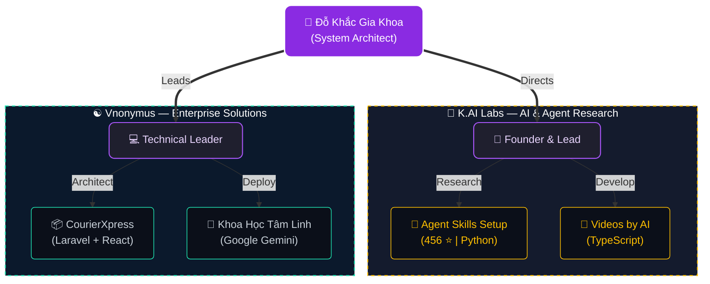

<h1 align="center">👋 
  <picture>
    <source media="(prefers-color-scheme: dark)" srcset="https://raw.githubusercontent.com/dokhacgiakhoa/dokhacgiakhoa/main/profile-3d-custom/name-dark.svg" />
    <source media="(prefers-color-scheme: light)" srcset="https://raw.githubusercontent.com/dokhacgiakhoa/dokhacgiakhoa/main/profile-3d-custom/name-light.svg" />
    
  </picture>
</h1>

### 💡 About Me
- 🎓 Software Engineering at **FPT Aptech** (Batch **T2508M**)
-  Nationality: **Vietnamese**
- 🌱 Currently focusing on **Full-stack Development**, **System Design**, and **AI Integration**
- 🎯 Goal: Bridging logical programming with intuitive system analysis to create high-impact solutions.
- 🔭 Founder of **K.AI Labs** & Leader of **Vnonymus**
- 🌍 Personal Website: [https://dokhacgiakhoa.github.io](https://dokhacgiakhoa.github.io)

---

### 🛠️ Tech Stack

  <b>🤖 AI & Large Language Models</b> 
  
  &nbsp;&nbsp;
  
  &nbsp;&nbsp;
  

  <b>🎨 Frontend</b> 
  
  
  
  

  <b>⚙️ Backend & Core Engineering</b> 
  
  
  
  
  
  
  

  <b>💾 Database & Cloud Infrastructure</b> 
  
  
  

  <b>🛠️ Developer Tools & Workflow</b> 
  
  
  

---

### 🔮 Ecosystem & Projects Architecture

---

### 🏆 KEY PROJECTS

<table width="100%">
  <tr>
    <td width="50%" valign="top">
      <h4 align="center">🤖 Agent-skills-setup-for-AntiGravity</h4>
      
<i>Automated agent skills configuration and setup tool for AntiGravity IDE.</i>

      

        
        
      

      

        
        
        
        
      

    </td>
    <td width="50%" valign="top">
      <h4 align="center">📦 CourierXpress</h4>
      
<i>An Enterprise Logistics Platform designed for scalable supply chain management.</i>

      

        
      

      

        
        
        
        
      

    </td>
  </tr>
  <tr>
    <td width="50%" valign="top">
      <h4 align="center">🎥 videos-by-AI</h4>
      
<i>AI-driven automated video generation and processing pipeline.</i>

      

        
      

      

        
        
        
        
      

    </td>
    <td width="50%" valign="top">
      <h4 align="center">☯️ Khoa Học Tâm Linh</h4>
      
<i>AI-powered platform for Bát Tự (Four Pillars) and Numerology analysis.</i>

      

        
      

      

        
        
        
        
      

    </td>
  </tr>
</table>

---

### 📊 GitHub Stats

  
  

---

### 🌐 My Channel

  &nbsp;&nbsp;
  &nbsp;&nbsp;
  

  &nbsp;&nbsp;
  &nbsp;&nbsp;
  

---

### 🧊 3D Contribution Graph

  <picture>
    <source media="(prefers-color-scheme: dark)" srcset="https://raw.githubusercontent.com/dokhacgiakhoa/dokhacgiakhoa/main/profile-3d-custom/github-contribution-3d-dark.svg" />
    <source media="(prefers-color-scheme: light)" srcset="https://raw.githubusercontent.com/dokhacgiakhoa/dokhacgiakhoa/main/profile-3d-custom/github-contribution-3d-light.svg" />
    
  </picture>

> 🔮 *Generated by [git-page-3d-infographic](https://github.com/Dokhacgiakhoa/git-page-3d-infographic) — Mysterious Dark Purple & Gold Theme*

---

### 🎥 Latest YouTube Videos
<!-- YOUTUBE-VIDEOS-LIST:START -->
<!-- YOUTUBE-VIDEOS-LIST:END -->

---

© 2024 K.AI Labs. All Rights Reserved.

